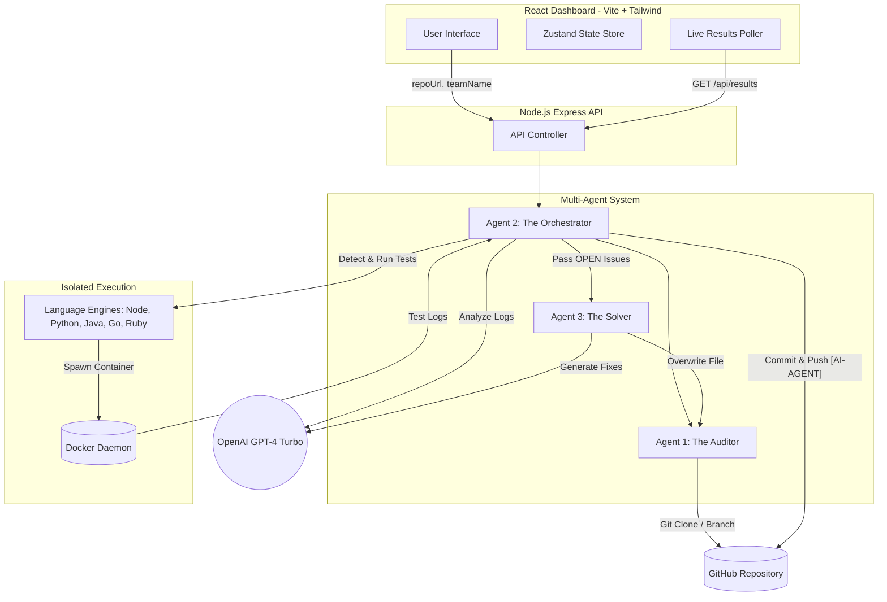

# 🤖 AutoHeal Agent: Autonomous CI/CD Healing System

**AutoHeal Agent** is a production-ready, multi-agent AI system designed to autonomously detect, analyze, and repair code failures in CI/CD pipelines. By leveraging **LangGraph.js** and **Docker sandboxing**, it provides a "Self-Healing" layer for modern DevOps workflows.

---

## 🏗️ System Architecture

The project employs a specialized **Multi-Agent Orchestration** pattern to ensure separation of concerns and robust error handling.

### 1. The Auditor (Agent One)
* **Role**: Repository discovery and preparation.
* **Workflow**: Clones the target repository using provided GitHub credentials, analyzes the project structure, and creates a unique branch following the mandatory `TEAM_LEADER_AI_Fix` format.
* **Source**: `backend/src/agents/auditor.js`

### 2. The Orchestrator (Agent Two)
* **Role**: Central controller and pipeline monitor.
* **Workflow**: 
    * **Engine Detection**: Dynamically identifies the tech stack (Node, Python, Java, Go, Ruby) using specialized discovery engines.
    * **Healing Loop**: Manages a strict 6-iteration loop to monitor pipeline status.
    * **State Management**: Aggregates test outputs, tracks "Re-opened" issues that persist across iterations, and ensures a final `PASSED` status only when the sandbox returns `ExitCode 0`.
* **Source**: `backend/src/agents/orchestrator.js`

### 3. The Solver (Agent Three)
* **Role**: Targeted code repair specialist.
* **Workflow**: Receives bug context (file, line, type, description) and the raw failing test output. It utilizes **GPT-4-Turbo** to generate surgical code fixes, which are then physically written back to the source files.
* **Source**: `backend/src/agents/solver.js`

---

### High-Level Architecture Diagram



## 🚀 Key Features

* **Polyglot Support**: Native engines for **Node.js, Python, Java, Go, and Ruby**.
* **Sandboxed Execution**: All tests and repairs are executed inside isolated **Docker containers** via `dockerode`, preventing host contamination.
* **Persistence Handling**: Detects recurring errors and automatically re-opens "Fixed" issues for deeper analysis if the tests continue to fail.
* **Compliance-First Commits**: Every repair is committed issue-wise with the mandatory `[AI-AGENT]` prefix.
* **Real-time Dashboard**: A React-based interface showing a live execution timeline, score breakdown, and detailed fixes table.

---

## 🛠️ Tech Stack

* **Frontend**: React (Vite), Tailwind CSS, Zustand
* **Backend**: Node.js, Express, LangGraph.js, Simple-Git
* **AI Engine**: OpenAI GPT-4-Turbo
* **Infrastructure**: Docker (Docker-in-Docker socket mounting)

---

## 📦 Installation & Setup

### 1. Environment Configuration
Create a `.env` file in the `/backend` folder:
```env
PORT=3000
OPENAI_API_KEY=your_key_here
GITHUB_TOKEN=your_token_here
HOST_WORKDIR=D:\path\to\autoheal_agent
```

### 2. Deploy with Docker
```bash
docker-compose up --build
```

### 3. Frontend Setup
```bash
cd frontend
npm install
npm run dev
```

---

## 📊 Evaluation Metrics (PS3 Standards)

* **Base Score**: 100 points
* **Speed Bonus**: +10 points for execution under 5 minutes
* **Efficiency Penalty**: -2 points for every commit exceeding 20

## 👥 Team VicRaptors
* **Vinayak Gawade** (Team Leader)
* **Aditya Patil** 
* **Amit Kumar Singh** 
* **Advait Ithape** 

